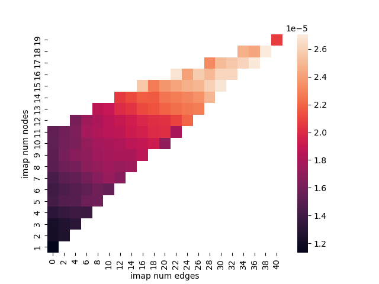
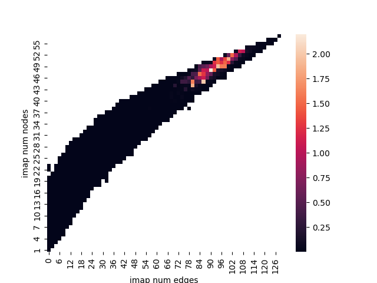
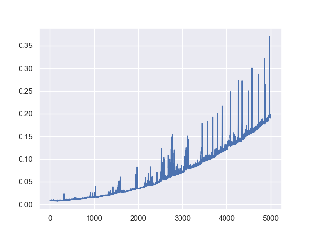

# Qiskit Advocate Mentorship Project Spring, 2022 [Transpiler Hackathon](https://github.com/QAMP-Spring-2022-Transpiler-Hackathon)

## Checkpoint 2

### Team

* Harshit Gupta

* Oskar Słowik

* Jack Woehr (mentor)

### General

We have been working to submit PRs on Transpiler issues with the kind assistance of Matthew Treinish and Kevin Krsulich of the IBM team. We are gratified at their indication that our work is helpful to Qiskit.

### Issues

### 1. Issue 7386

#### Status : <font color="purple"> Resolved </font>

- Pull Request [7542](https://github.com/Qiskit/qiskit-terra/pull/7542)

#### Description
- This issue required a change in how the transpiler decided to stop its optimization loop
- Previously if the depth of a quantum circuit was constant after an optimization pass, then the transpiler stopped its operations. If not, the optimization loop continued
- After this PR the check was expanded to also include the size of the quantum circuit, allowing a greater level optimization.
- Files affected - 
  ```
  qiskit/transpiler/preset_passmanagers/level1.py
  qiskit/transpiler/preset_passmanagers/level2.py
  qiskit/transpiler/preset_passmanagers/level3.py
  test/python/transpiler/test_preset_passmanagers.py
  ```

#### 2. Issue 7181 

#### Status : <font color ='purple'> Resolved </font> 
- Pull Request [7913](https://github.com/Qiskit/qiskit-terra/pull/7913)

#### Description
- As mentioned in issue #7181, the `Optimize1qSimpleCommutation` transpiler scaled superlinearly with the number of qubits
- There were two components of the pass which were optmized :
  - <b>`_find_adjoining_run`</b> function was optimized as it had some redundant computation trying to optimize the single qubit runs.
  - Along with the above function, <b>`_commute_through`</b> logic was also changed. Previously `insert` and `delete` methods were used in the internal workings. These functions were not efficient as for a given `n` sized container, they may take `O(n)` time for execution. They were replaced by a `deque` to save on some execution time. 

- More details to be found in the pull request above.

- Files affected - 
  ```
  qiskit/transpiler/passes/optimization/optimize_1q_commutation.py
  ```


#### 3. Issue 7113  

#### Status : <font color ='ligreen'> PR In Review </font>
- Pull Request [7990](https://github.com/Qiskit/qiskit-terra/pull/7990)

#### Description
- This is a sub part of the larger issue #7113, to make the transpiler `Target` aware.
- The main passes which were taken up here are `Optimize1qSimpleCommutation` and `Optimize1qSimpleDecomposition`
- Essentially with `Target` interface being added in terra, there is more data available to the transpiler to inform the passes on the characteristics and constraints of a backend 
- `OptimizeSimple1qCommutation` did not have any direct dependencies for the `Target` 
- In `Optimize1qGatesDecomposition`, some changes were introduced to extend the checking of whether a gate was present in the basis set or the `Target` basis set.
- More details to be found in the pull request above.

- Files affected - 
```
qiskit/transpiler/passes/optimization/optimize_1q_commutation.py
qiskit/transpiler/passes/optimization/optimize_1q_decomposition.py
```

#### 4. Issue 7485 

#### Status : <font color ='ligreen'> PR In Review </font> 
- Pull Request [7989](https://github.com/Qiskit/qiskit-terra/pull/7989)

#### Description
- This issue exposes the memory leakage present in `BasisTranslator`, `DAGFixedPoint`, `BarrierBeforeFinalMeasurements` and `Decompose` transpiler passes.
- Till now, some progress has been made to optimize the `DAGFixedPoint` and the `Decompose` passes
  ##### `Decompose`
- To improve the run time performance of this pass, a change was made to the `_should_decompose` method. 
- Originally, it tried to make two variables repeatedly during the call of the method.
- This should not be the case as the lists only depend on an attribute of the pass, which is invariant during the call of the `run` method
- These variables were cached as atrributes to somewhat improve the run time of the pass.
- Work still in progress for other passes.
- For more details, please refer the pull request above.

- Files targeted - 
```
qiskit/transpiler/passes/basis/basis_translator.py
qiskit/transpiler/passes/basis/decompose.py
qiskit/transpiler/passes/utils/dag_fixed_point.py
qiskit/transpiler/passes/utils/merge_adjacent_barrier.py
qiskit/transpiler/passes/utils/barrier_before_final_measurements.py
```


### 5. Issue 7705
#### Status : <font color ='orange'> In progress </font>
#### Description
- This is one of the major issues we want to resolve. As mentioned in issue #7705, the `vf2layout` has hardcoded runtime limits for each optimization level. The goal is to obtain adaptive limits that would scale with the size of the problem.
- To tackle this issue we are experimenting with benchmarks using heavy square and heavy hex graphs as targets and various subgraphs. 
- Each subgraph is run 5 times and if all runs pass, the average runtime is collected, together with subgraph paramteres. Current parameters are: number of vertices |V| and edges |E|. Finally, runtimes are visualized on a heatmap as a function of |V| and |E|. Runtimes for subgraphs with the same |V| and |E| are combined using: average, min, max. Hence, we get three heatmaps and fourth heatmap with standard deviation.
- Initially we were testing for sugraphs with fixed topology. This way we obtained scaling for linear graphs. However, in general it was not a good approach due to restricted topology of heavy square and heavy hex.
- We changed the strategy and started testing radom graphs obtained from the target graph by removing randomly chosen vertices, so that the resulting graph is always a subgraph of the target graph. We collected the data by changing the number of removed vertices and number of runs, for some small heavy hex graphs.
- Our preliminary results show some patterns in the runtimes but further work is needed. We are planning to add random deletion of vertices and perhaps take into account more refined properties of subgraphs, such as connectivity.
- ##### Experiments - 
  - Mean of the run times for varying number of instruction map edges and vertices, with dropping vertices
  

  - Max of the run times for varying number of instruction map edges and vertices, with dropping vertices 
  

  - Mean runtime as a function of number of qubits (nodes) in a line subgraph
  

- Files affected - 
```
None yet
```


